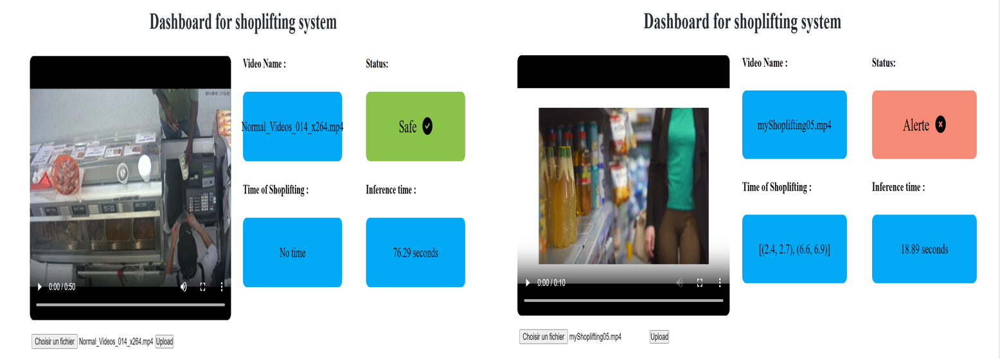

# 🛍️ Edge-AI-for-Anomaly-Detection-in-Retail-

An intelligent, real-time shoplifting detection system deployed on the Edge using optimized deep learning models.

## 📌 Overview

Shoplifting causes billions of dollars in losses for retailers every year. Traditional surveillance methods are often costly and inefficient.  
This project introduces a smart and scalable Edge AI-based solution for real-time detection of shoplifting through surveillance video analysis.

The solution uses advanced model optimization techniques and deployment tools to make the system lightweight, fast, and deployable on resource-constrained edge devices.

---

## 🧠 Technologies Used

- **OpenVINO™ Toolkit** – for model optimization and inference
- **Edge Computing** – for low-latency real-time detection
- **Docker** – for portable, scalable deployment
- **MQTT** – for lightweight device communication
- **Deep Learning** – with quantization and pruning to improve speed and efficiency

---

## 🏗️ System Architecture

> *Real-time detection pipeline from video input to alert generation, optimized for edge devices.*

---

## ⚙️ Optimization Techniques

### ✔️ Quantization
- Reduces numerical precision of weights and activations
- Minimizes memory usage and speeds up inference
- Perfect for deployment on embedded devices

### ✂️ Pruning
- Eliminates unnecessary neural connections
- Reduces model size and energy consumption
- Preserves overall accuracy

---

## 🐳 Dockerized Deployment

Docker provides:
- Full isolation and portability
- Easier updates and dependency management
- Scalable across multiple environments

---

## 📊 Results

| Metric               | Before Optimization | After Optimization |
|----------------------|---------------------|--------------------|
| Model Size           | Large               | Smaller            |
| Inference Time       | High latency        | Real-time capable  |
| Accuracy             | Maintained          | Maintained         |
| Energy Consumption   | High                | Reduced            |

📸 *Visual Comparison:*

---

## 📽️ Detection Example

Here is an example of how our system identifies a suspicious shoplifting action:

---

